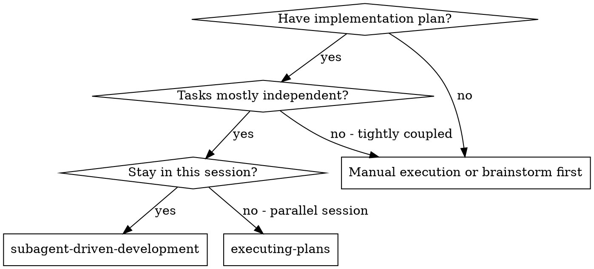
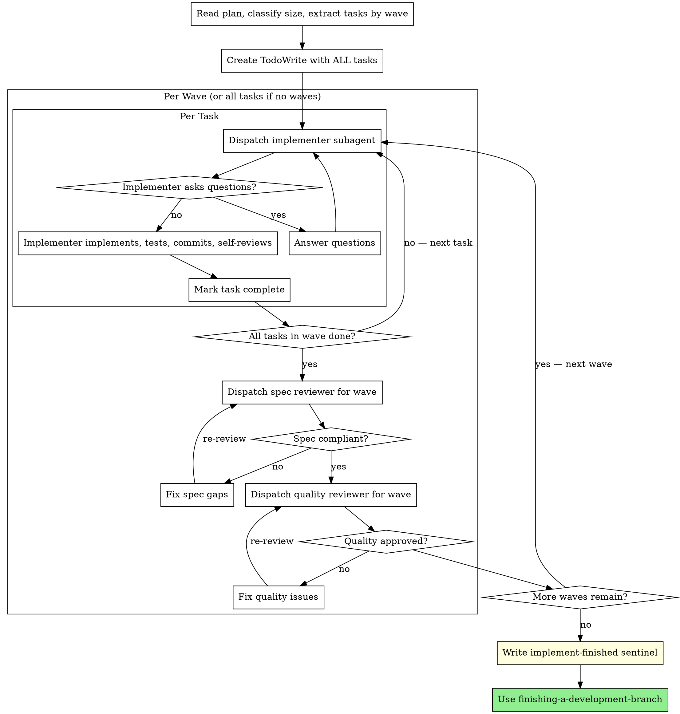

# Subagent-Driven Development

Execute plan by dispatching fresh subagent per task, with wave-level review checkpoints.

**Core principle:** Fresh subagent per task + review per wave (not per task) = high quality without unnecessary overhead

## When to Use



**vs. Executing Plans (parallel session):**
- Same session (no context switch)
- Fresh subagent per task (no context pollution)
- Review after each wave (not each task) — less overhead
- Faster iteration (no human-in-loop between tasks)

## Review Model

Reviews are expensive (2 subagent dispatches each). Scale review frequency to plan size:

| Plan size | Review schedule |
|-----------|----------------|
| **Trivial** (1 task, no waves) | Implementer self-review only. No separate reviewer dispatch. |
| **Small** (2–3 tasks, no waves) | Implement all tasks, then one combined spec + quality review. |
| **Medium/Large** (waves) | Implement all tasks in a wave, then spec + quality review at wave boundary. |

**The key insight:** review at wave boundaries, not task boundaries. A wave is the natural checkpoint — all tasks within it are related and should be reviewed together for coherence.

## The Process



## Sizing-Aware Dispatch

On plan load, check the **Size** field in the plan header. If absent, infer from task/wave count:

- **1 task, no waves** → Trivial. One implementer, self-review, done.
- **2–3 tasks, no waves** → Small. Implement all, then one combined review.
- **Has waves** → Medium/Large. Implement per wave, review at wave boundary.

**For trivial plans:** skip reviewer subagents entirely. The implementer self-review + the final build/test verification is sufficient. Don't spend 2 extra subagent dispatches reviewing a one-task change.

**For small plans (no waves):** treat all tasks as one wave. Implement them sequentially, then do one spec review and one quality review covering all tasks together. This gives you 2 reviewer dispatches total instead of 2 per task.

**For medium/large plans (with waves):** the spec and quality reviewers review ALL tasks completed in that wave together. The reviewer prompt should include the full wave spec (all task descriptions) and all commits in the wave.

## TodoWrite — Mandatory on Plan Load

**Immediately after reading the plan**, before dispatching any subagent, call `TodoWrite` with
ALL tasks as `pending`. This is not optional — it ensures the session task list reflects the
full plan from the start.

```
TodoWrite([
  { content: "Task 1: [Component Name]", status: "pending", priority: "high" },
  { content: "Task 2: [Component Name]", status: "pending", priority: "high" },
  ...
])
```

Mark each task `in_progress` when you dispatch its implementer, and `completed` after it
passes implementation (not after review — review happens at wave level).

## Signaling Completion

After the final review passes and before invoking `finishing-a-development-branch`,
**signal that implementation is done.**

Check whether you're running under kasmos orchestration:

```bash
echo "${KASMOS_MANAGED:-}"
```

**If `KASMOS_MANAGED=1`:** Write a sentinel file — kasmos transitions the plan automatically.

```bash
touch docs/plans/.signals/implement-finished-<date>-<name>.md
```

The filename must match the plan filename exactly. **Do not edit `plan-state.json` directly.**

**If `KASMOS_MANAGED` is unset:** Update `plan-state.json` directly — set the plan's
status to `"reviewing"`.

## Prompt Templates

- `./implementer-prompt.md` - Dispatch implementer subagent
- `./spec-reviewer-prompt.md` - Dispatch spec compliance reviewer subagent (at wave boundary)
- `./code-quality-reviewer-prompt.md` - Dispatch code quality reviewer subagent (at wave boundary)

**When dispatching wave-level reviewers**, include ALL task specs and ALL commits from the wave — not just one task. The reviewer needs the full wave context.

## Example Workflow — Small Plan (no waves, 3 tasks)

```
You: I'm using Subagent-Driven Development to execute this plan.
     Plan size: Small (3 tasks, no waves)

[Read plan, extract all 3 tasks]
[Create TodoWrite with all 3 tasks — MANDATORY]

--- Task 1: Form overlay ---
[Dispatch implementer with Task 1 spec]
Implementer: Done. Tests pass. Committed.
[Mark Task 1 complete]

--- Task 2: Key handler + state ---
[Dispatch implementer with Task 2 spec]
Implementer: Done. Tests pass. Committed.
[Mark Task 2 complete]

--- Task 3: Lifecycle integration ---
[Dispatch implementer with Task 3 spec]
Implementer: Done. Tests pass. Committed.
[Mark Task 3 complete]

--- Wave review (all 3 tasks) ---
[Dispatch spec reviewer with ALL 3 task specs + all commits]
Spec reviewer: ✅ All requirements met

[Dispatch quality reviewer with all commits]
Quality reviewer: ✅ Clean code, good tests

[Write sentinel]
Done! Invoking finishing-a-development-branch...
```

## Example Workflow — Medium Plan (2 waves)

```
You: I'm using Subagent-Driven Development to execute this plan.
     Plan size: Medium (5 tasks, 2 waves)

--- Wave 1: Foundation (Tasks 1-3) ---
[Implement Task 1, 2, 3 sequentially with fresh subagent each]

[Dispatch spec reviewer for Wave 1 — all 3 task specs + commits]
Spec reviewer: ✅

[Dispatch quality reviewer for Wave 1]
Quality reviewer: One issue in Task 2 — missing error handling
[Dispatch fix subagent for the issue]
[Re-dispatch quality reviewer]
Quality reviewer: ✅

--- Wave 2: Integration (Tasks 4-5) ---
[Implement Task 4, 5 sequentially]

[Dispatch spec reviewer for Wave 2]
[Dispatch quality reviewer for Wave 2]
Both: ✅

[Write sentinel]
Done!
```

## Advantages

**vs. Per-task review (old model):**
- Dramatically fewer subagent dispatches (2 reviewers per wave vs. 2 per task)
- Reviewers see full wave context — catch integration issues, not just per-task issues
- No review overhead for trivial tasks that got bundled into a larger task

**vs. Manual execution:**
- Subagents follow TDD naturally
- Fresh context per task (no confusion)
- Parallel-safe (subagents don't interfere)
- Subagent can ask questions (before AND during work)

**vs. Executing Plans:**
- Same session (no handoff)
- Continuous progress (no waiting)
- Review checkpoints automatic

## Red Flags

**Never:**
- Start implementation on main/master branch without explicit user consent
- Skip wave-level reviews (spec compliance AND code quality)
- Proceed with unfixed issues from review
- Treat Minor issues as non-blocking — all tiers must pass
- Dispatch multiple implementation subagents in parallel (conflicts)
- Make subagent read plan file (provide full text instead)
- Skip scene-setting context (subagent needs to understand where task fits)
- Ignore subagent questions (answer before letting them proceed)
- **Review every single task individually** — review at wave boundaries
- **Skip TodoWrite on plan load** (session task list must reflect plan from the start)
- **Skip implement-finished sentinel** (kasmos won't know implementation is done)
- **Create a separate "cleanup" or "polish" task** — bundle cleanup into the task it serves

**If subagent asks questions:**
- Answer clearly and completely
- Provide additional context if needed
- Don't rush them into implementation

**If reviewer finds issues:**
- ALL tiers are blocking — Critical, Important, and Minor
- Dispatch fix subagent with specific instructions for every flagged issue
- Reviewer reviews again after fixes
- Repeat until reviewer reports zero issues
- Don't skip the re-review
- Don't skip Minor issues — they are not "nice to have"

**If subagent fails task:**
- Dispatch fix subagent with specific instructions
- Don't try to fix manually (context pollution)

## Integration

**Required workflow skills:**
- **superpowers:using-git-worktrees** - REQUIRED: Set up isolated workspace before starting
- **superpowers:writing-plans** - Creates the plan this skill executes
- **superpowers:requesting-code-review** - Code review template for reviewer subagents
- **superpowers:finishing-a-development-branch** - Complete development after all tasks

**Subagents should use:**
- **superpowers:test-driven-development** - Subagents follow TDD for each task

**Alternative workflow:**
- **superpowers:executing-plans** - Use for parallel session instead of same-session execution
